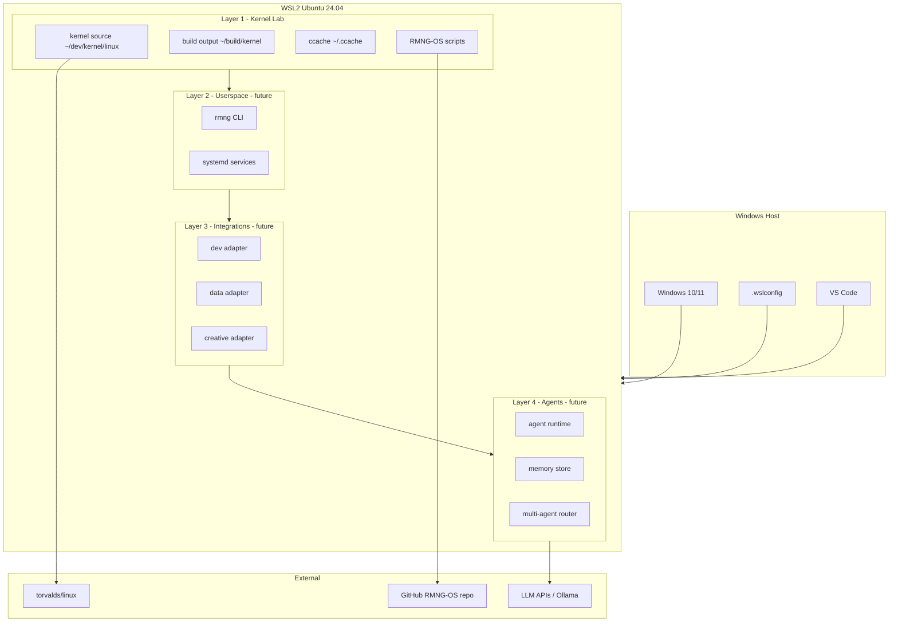
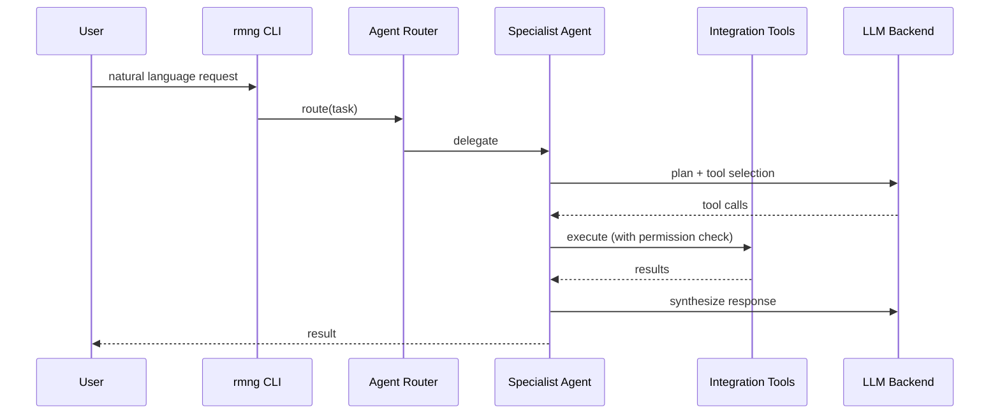

# RMNG-OS Technical Architecture

**Version:** 0.1  
**Status:** Draft  
**Last updated:** 2026-06-30

## 1. System context

RMNG-OS runs as a development and (eventually) runtime stack on a Windows host with WSL2, evolving toward a standalone Linux environment with native agent orchestration.



---

## 2. Layer 1 — Kernel foundation (current)

### 2.1 Component diagram

```
┌──────────────────────────────────────────────────────────┐
│ RMNG-OS repo (~/dev/projects/RMNG-OS)                    │
│  scripts/kernel-env.sh  config/*.example  docs/          │
└────────────────────────┬─────────────────────────────────┘
                         │ symlinks / copy
                         ▼
┌──────────────────────────────────────────────────────────┐
│ ~/scripts/          ~/build/kernel/       ~/.ccache/     │
│  kernel-env.sh        .config, vmlinux     compiler cache │
│  rmng-build.sh        *.o, *.ko (gitignored)             │
│  rmng-status.sh                                            │
└────────────────────────┬─────────────────────────────────┘
                         │ make O=KBUILD
                         ▼
┌──────────────────────────────────────────────────────────┐
│ ~/dev/kernel/linux/  (torvalds/linux — separate clone)     │
│  pristine source tree, never holds build artifacts         │
└──────────────────────────────────────────────────────────┘
```

### 2.2 Build pipeline

| Step | Command / artifact |
|------|-------------------|
| 1. Environment | `source ~/scripts/kernel-env.sh` |
| 2. Config | `config/wsl-kernel.config.slim.example` → `$KBUILD/.config` |
| 3. Normalize | `make O=$KBUILD olddefconfig` |
| 4. Compile | `make O=$KBUILD -j6` |
| 5. Output | `$KBUILD/vmlinux`, `System.map`, modules |

### 2.3 Config variants

| File | Lines | Modules | Use case |
|------|-------|---------|----------|
| `wsl-kernel.config.example` | ~8,821 | ~984 | Full WSL parity reference |
| `wsl-kernel.config.slim.example` | ~5,498 | ~19 | Daily development builds |

### 2.4 Technology stack (Layer 1)

| Component | Technology |
|-----------|------------|
| Host OS | Windows 10/11 |
| Virtualization | WSL2 (Hyper-V) |
| Guest OS | Ubuntu 24.04 LTS |
| Compiler | GCC 13.3, ccache 4.9 |
| Build system | GNU Make (kbuild) |
| Kernel | Linux mainline (torvalds/master) |
| IDE | VS Code + WSL extension |
| VCS | Git + GitHub (`gh`) |

---

## 3. Layer 2 — Userspace (planned)

### 3.1 Proposed components

| Component | Responsibility |
|-----------|----------------|
| `rmng` CLI | User-facing command: build, status, agent chat |
| `rmngd` daemon | Background service for agents and integrations |
| `/etc/rmng/config.yaml` | Central configuration |
| systemd units | Start agent runtime on boot |

### 3.2 Directory layout (future)

```
~/rmng/
├── config.yaml
├── data/           # agent memory, state
├── logs/           # structured JSON logs
└── run/            # runtime sockets
```

---

## 4. Layer 3 — Integrations (planned)

### 4.1 Adapter pattern

```python
# Conceptual interface (language TBD — see REQUIREMENTS Q-01)
class Integration:
    name: str
    version: str
    tools: list[Tool]      # callable actions
    auth: AuthConfig       # credentials needed

class Tool:
    name: str
    description: str
    parameters: JSONSchema
    execute(params) -> Result
```

### 4.2 Domain map

| Package | Path | Tools (examples) |
|---------|------|------------------|
| Development | `integrations/dev/` | `git_status`, `make_build`, `run_tests` |
| Data | `integrations/data/` | `query_db`, `read_csv` |
| Creative | `integrations/creative/` | `generate_doc`, `export_media` |
| Business | `integrations/business/` | `send_email`, `create_event` |
| Infrastructure | `integrations/infra/` | `deploy`, `check_health` |
| Shared | `integrations/shared/` | `http_get`, `read_file` |

---

## 5. Layer 4 — Agent orchestration (planned)

### 5.1 Request flow



### 5.2 Permission model (draft)

| Level | Actions | Approval |
|-------|---------|----------|
| **Read** | file read, git status, query | Auto |
| **Write** | file edit, git commit | Auto (configurable) |
| **Execute** | build, test, deploy | User confirm |
| **Destructive** | rm, force push, sudo | Always confirm |

### 5.3 Memory architecture (draft)

| Tier | Storage | TTL | Purpose |
|------|---------|-----|---------|
| Session | In-memory | Session | Current conversation |
| Short-term | `~/rmng/data/short/` | Days | Recent context |
| Long-term | `~/rmng/data/long/` | Permanent | User preferences, facts |

---

## 6. Data boundaries

| Data | Location | In git? |
|------|----------|---------|
| RMNG-OS scripts/docs | `~/dev/projects/RMNG-OS` | ✅ Yes |
| Kernel source | `~/dev/kernel/linux` | ❌ Separate repo |
| Build artifacts | `~/build/kernel` | ❌ Never |
| ccache | `~/.ccache` | ❌ Never |
| Agent memory (future) | `~/rmng/data` | ❌ Never |
| Secrets / API keys | env / keyring | ❌ Never |

---

## 7. Security architecture (draft)

```
User request
    │
    ▼
┌─────────────┐
│ Auth layer  │  ← future: user session
└──────┬──────┘
       ▼
┌─────────────┐
│ Permission  │  ← allowlist + confirmation gates
│   gate      │
└──────┬──────┘
       ▼
┌─────────────┐
│ Tool exec   │  ← sandboxed paths, no raw sudo
└─────────────┘
```

---

## 8. Deployment targets

| Target | Layer 1 | Layer 2+ | Notes |
|--------|---------|----------|-------|
| **WSL2** (current) | ✅ | Planned | Primary dev environment |
| **VM** | Portable | Planned | QEMU/VirtualBox testing |
| **Bare metal** | Portable | Future | Custom RMNG kernel boot |
| **Cloud VM** | Portable | Future | Agent server deployment |

---

## 9. Related documents

- [REQUIREMENTS.md](REQUIREMENTS.md) — formal requirements
- [VISION.md](VISION.md) — product vision
- [ROADMAP.md](ROADMAP.md) — delivery phases
- [DECISIONS.md](DECISIONS.md) — architecture decisions