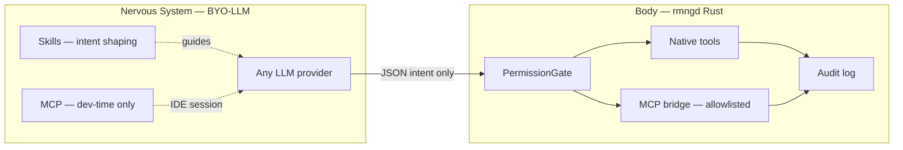

# Plan: Agents, Skills, Tools & MCP — RMNG-OS

**Version:** 1.0  
**Date:** 2026-06-30  
**Status:** Approved plan · implementation Phase 6  
**Principle:** BYO-LLM nervous system + local Rust body (ADR-010). External repos inform design; **rmngd owns execution**.

---

## 1. Architectural constraint (non-negotiable)



| Plane | What lives here | GitHub repo? |
|-------|-----------------|--------------|
| **Nervous** | LLM config (`~/.rmng/config.toml`), skills, IDE MCP | Skills yes · MCP config **local only** |
| **Body** | `rmngd`, `rmng-core` tools, integration manifests | Yes |
| **Dev IDE** | Cursor/VS Code MCP (`~/.cursor/mcp.json`) | Example templates only |

**Rule:** No LLM or IDE MCP server gets raw shell. All production execution flows through `rmngd` + `PermissionGate`.

---

## 2. Source repos (curated from top GitHub OSS)

Ranked by relevance to **kernel lab + RMNG-OS development**, not generic SaaS.

### Tier A — Adopt patterns / wire first

| Repo | Stars | Use in RMNG-OS |
|------|-------|----------------|
| [modelcontextprotocol/servers](https://github.com/modelcontextprotocol/servers) | ~88k | Reference servers: `git`, `filesystem`, `fetch`, `memory`, `time` |
| [modelcontextprotocol/rust-sdk](https://github.com/modelcontextprotocol/rust-sdk) | official | **rmng-mcp** client inside Body (Phase 6b) |
| [github/github-mcp-server](https://github.com/github/github-mcp-server) | official | Issues, PRs, Actions — dev + `git.*` tool parity |
| [agentskills/agentskills](https://github.com/agentskills/agentskills) | spec | `skills/` directory format (SKILL.md) |

### Tier B — Dev-time IDE MCP (local install)

| Repo / package | Use |
|----------------|-----|
| `@modelcontextprotocol/server-filesystem` | Read `docs/`, `scripts/`, `config/` (path-allowlisted) |
| `uvx mcp-server-git` | Richer git than `git.status` — **dev only** |
| `@modelcontextprotocol/server-fetch` | Kernel docs, WSL boot references |
| `@modelcontextprotocol/server-memory` | Cross-session build decisions |
| [upstash/context7](https://github.com/upstash/context7) | Library/docs lookup (already common in IDEs) |

### Tier C — Phase 7+ (defer)

| Repo | Reason to defer |
|------|-----------------|
| [awslabs/mcp](https://github.com/awslabs/mcp) | Cloud infra — after bare-metal / deploy story |
| Playwright / Puppeteer MCP | No browser automation in kernel lab |
| Postgres / Redis MCP | No data layer yet |
| [punkpeye/awesome-mcp-servers](https://github.com/punkpeye/awesome-mcp-servers) | **Index only** — 90k stars, use for discovery not vendoring |

### Explicitly not vendored into RMNG-OS repo

- Full agent orchestration frameworks (AutoGPT, CrewAI, etc.) — RMNG has `rmngd`
- IDE-specific agent marketplaces — stay in `~/.cursor`, `~/.claude` locally
- Any repo that requires cloud API keys in git

---

## 3. Four artifact types — where each goes

### 3.1 Native tools (Body — already started)

**Location:** `agents/rmng-core/src/tools/` + `integrations/dev/*.json`

| Tool | Status | Replaces MCP? |
|------|--------|---------------|
| `kernel.status` | ✅ | Dev `filesystem` read-only subset |
| `kernel.build` | ✅ | — |
| `kernel.apply_patches` | ✅ | — |
| `git.status` | ✅ | Partial overlap with `mcp-server-git` |
| `git.diff` | Planned | — |
| `github.pr_status` | Planned | Overlap with `github-mcp-server` |

**Policy:** Prefer **native Rust tools** for anything `rmngd` must run unattended. MCP is for IDE assistance and optional bridged tools.

### 3.2 Skills (Nervous — intent shaping)

**Location:** `skills/` in RMNG-OS repo (public, no IDE vendor names)

```
skills/
├── kernel-build/SKILL.md      # patch, rebuild, benchmark workflow
├── kernel-config/SKILL.md     # menuconfig, localmodconfig, slim
├── git-workflow/SKILL.md      # commit, push, phase validation
└── phase-gates/SKILL.md       # what "done" means per ROADMAP phase
```

**Format:** [Agent Skills open standard](https://agentskills.io) — YAML frontmatter + markdown body.

**Consumption:**
- Phase 6a: Human + IDE agents read skills from repo path
- Phase 6c: `rmng ask` injects skill summary into nervous-system prompt when `--skill kernel-build`

### 3.3 Agents (specialists — definitions only)

**Location:** `agents/definitions/` (not the Rust workspace)

| Agent ID | Role | Maps to tools |
|----------|------|---------------|
| `kernel-engineer` | Patches, configs, builds | `kernel.*` |
| `repo-keeper` | Git hygiene, docs sync | `git.*` |
| `doc-validator` | REQUIREMENTS/ROADMAP checks | read-only |
| `orchestrator` | Phase planning | Plan intents only |

These are **RMNG specialist prompts**, not third-party agent packs. Runtime routing via `rmngd` in Phase 7.

### 3.4 MCP servers

**Dev template:** `config/mcp-servers.example.json` (copy to `~/.cursor/mcp.json` or `~/.config/rmng/mcp.json`)

**Production bridge:** `~/.rmng/mcp-allowlist.toml` — which external MCP tools `rmngd` may proxy (Phase 6b).

---

## 4. Implementation phases

### Phase 6a — Skills + dev MCP template (2–3 days)

| # | Task | Output |
|---|------|--------|
| 1 | Add `skills/kernel-build/SKILL.md` | First skill |
| 2 | Add `config/mcp-servers.wsl.example.json` | Local IDE template |
| 3 | Add `scripts/setup-dev-mcp.sh` | Install Tier B servers via npx/uvx |
| 4 | Document in `docs/daily-workflow.md` | Dev MCP section |

**Exit criteria:** Cursor/VS Code can use filesystem + git MCP against RMNG-OS paths; skills readable from repo.

### Phase 6b — MCP bridge in Body (1–2 weeks)

| # | Task | Output |
|---|------|--------|
| 1 | New crate `agents/rmng-mcp` using `rust-sdk` | MCP client |
| 2 | `McpAllowlist` in `~/.rmng/mcp-allowlist.toml` | Gate external tool names |
| 3 | `PermissionGate` extends to `mcp.*` prefixed tools | Unified audit |
| 4 | Map `mcp.git.log` → proxied call | One reference bridge |

**Exit criteria:** `rmng send` can invoke one allowlisted MCP tool through `rmngd`; audit log records it.

### Phase 6c — Skills → nervous system (3–5 days)

| # | Task | Output |
|---|------|--------|
| 1 | `rmng ask --skill kernel-build "rebuild after patch"` | Skill-aware mock/live |
| 2 | Skill index in `skills/INDEX.md` | Discoverability |

### Phase 7 — Multi-agent routing

- `orchestrator` agent delegates to specialists
- Shared memory (native, not MCP memory server, for production)

---

## 5. Recommended MCP server set (WSL kernel lab)

Copy `config/mcp-servers.wsl.example.json` locally. **Do not commit tokens.**

| Server | Command | Allowlisted paths |
|--------|---------|-------------------|
| filesystem | `npx @modelcontextprotocol/server-filesystem` | `~/dev/projects/RMNG-OS`, `~/dev/kernel/linux`, `~/build/kernel` |
| git | `uvx mcp-server-git` | `~/dev/projects/RMNG-OS` |
| fetch | `npx @modelcontextprotocol/server-fetch` | network (read-only) |
| github | `npx @github/github-mcp-server` | `Ishwanku/RMNG-OS` via `gh` token |
| memory | `npx @modelcontextprotocol/server-memory` | local only |

---

## 6. Decision record

See **ADR-014** in `docs/DECISIONS.md` — native tools first, MCP as dev assist + optional gated bridge.

---

## 7. Success metrics

| Metric | Target |
|--------|--------|
| Native tools in `rmng tools` | ≥ 8 by end Phase 6 |
| Skills in repo | ≥ 4 |
| MCP servers in dev template | 5 |
| MCP tools proxied through `rmngd` | ≥ 1 (reference) |
| Zero shell access from LLM/MCP | Enforced by gate |

---

## 8. Immediate next action

```bash
# Phase 6a kickoff (when approved to implement):
cd ~/dev/projects/RMNG-OS
./scripts/setup-dev-mcp.sh    # creates local MCP config from example
ls skills/
```

**Do not** bulk-clone awesome-mcp-servers or agent frameworks into the repo. Curate, allowlist, native-first.
